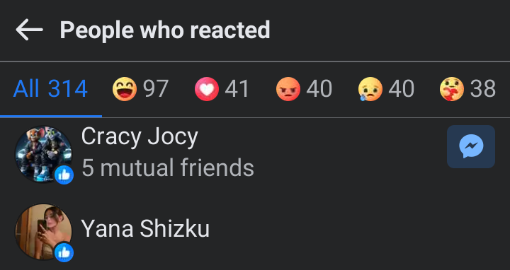
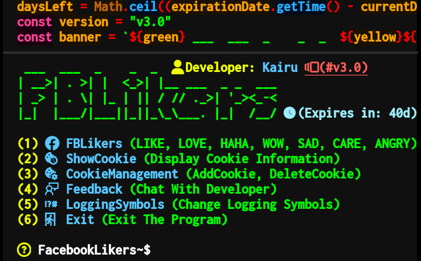
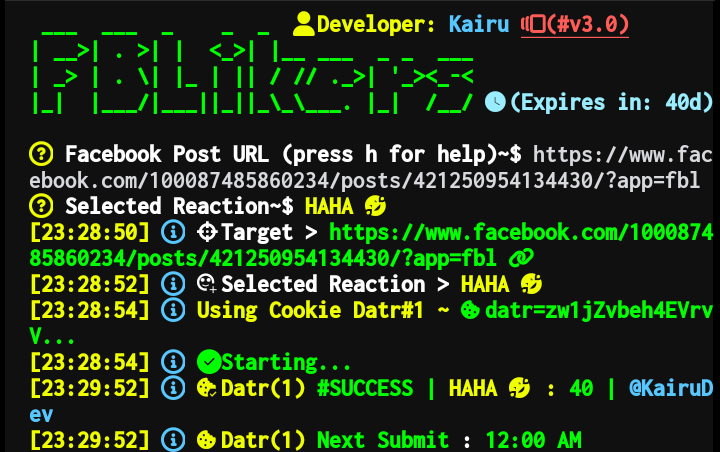

# FacebookLikers

**FBLikers is a Node.js script that automates interactions with Facebook posts to perform reactions. It allows you to like, love, haha, wow, sad, angry, or care on Facebook posts using provided cookies.**

## Installation
```bash
cd $HOME &&
pkg update -y
pkg install git -y &&
rm -rf FBLikers &&
git clone https://github.com/Kairu-bit/FBLikers &&
cd FBLikers &&
chmod +x ./setup.sh &&
./setup.sh
```

## Usage 
```bash
FBL
```

## Contact Information
- **[Kyle Tilano](https://www.facebook.com/KairuxDev)** on Facebook
- **[KairuDev](https://t.me/KairuDev)** on Telegram

## Commands
- **FBLikers:** Like, Love, Haha, Wow, Sad, Care, Angry.
- **ShowCookie:** Display Cookie Information.
- **CM (CookieManagement):** AddCookie, DeleteCookie.
- **LoggingSymbols:** Change Logging Symbols.
- **Feedback:** Chat With Developer.
- **Exit:** Exit The Program.

## Note
- **Ensure that your Facebook post is set to public.**
- **Use Facebook Lite or Chrome to copy the link of the post.**
- **Avoid using your personal account to prevent account suspension.**
- **Do not share your cookies publicly. Keep your authentication data secure.**

## Screenshots



